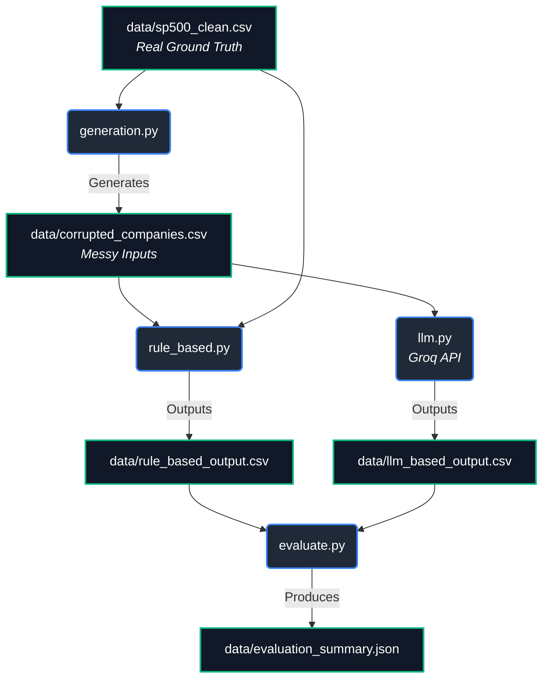

# CleanData Pipeline

A small applied comparison of two approaches to the same real data-cleaning
problem: standardizing messy, inconsistent company names to their canonical
form. Built to answer a practical question data teams actually face —
*when is it worth reaching for an LLM instead of writing more rules?*

## Problem

Real-world entity data (company names, addresses, product names) shows up
with typos, inconsistent casing, whitespace issues, abbreviation variants
("Inc." vs "Incorporated" vs "Inc"), and near-duplicate entries. This project
takes a real reference list — the S&P 500 — deliberately corrupts it in
realistic ways, then cleans it back up two different ways and measures which
wins, and where.

## Pipeline



## Data source

Ground-truth company names: the S&P 500 constituent list, downloaded from
[`datasets/s-and-p-500-companies`](https://github.com/datasets/s-and-p-500-companies)
(public domain, Open Data Commons license). ~503 real company names.

## The two approaches

### 1. Rule-based (`02_rule_based_cleaner.py`)
Deterministic, hand-written logic: regex whitespace/casing normalization,
an abbreviation mapping table (Intl → International, Corp → Corporation,
etc.), and fuzzy string matching (`rapidfuzz`) against the known list of
503 real company names to catch typos.

**Key dependency: this approach needs a reference list to fuzzy-match
against.** Without one, the typo-correction step doesn't work at all — it
can only normalize formatting, not fix misspellings.

### 2. LLM-based (Groq Llama 3.3)
Reads each messy name and outputs the canonical company name using the
model's trained knowledge of real companies — no reference list, no regex
rules. This runs live against Groq's high-speed API.

## Results

| Metric | Rule-Based | LLM-Based (Live) |
|---|---|---|
| Overall accuracy | 97.4% | 85.5% |
| Accuracy on plain corruption | 97.6% | 85.5% |
| Accuracy on near-duplicate rows | 95.6% | 85.3% |
| Speed (571 rows) | ~0.08s | ~37s |
| Cost (571 rows) | $0.00 | ~$0.00 |
| Needs a reference list? | Yes | No |

Run `python main.py` to regenerate this table from the raw outputs.

## Takeaway

Rule-based cleaning is free and instant, but its accuracy is *borrowed* from
having a clean reference list to fuzzy-match against — remove that list and
it can't fix typos at all, only formatting. The LLM approach doesn't need
one, because it brings its own knowledge of what a "real" company name looks
like. That's the actual trade-off, not just "AI is smarter": **rule-based
cleaning is a lookup problem, LLM cleaning is a recognition problem**, and
which one you need depends on whether you already have a trustworthy master
list of valid entities.

In practice, a real pipeline would use both: rule-based cleaning first
(free, instant, handles the easy 90%+), and only escalate the rows it can't
confidently resolve to an LLM — this is a common, cost-effective pattern in
production data-quality pipelines.


## How to run it yourself

```bash
pip install -r requirements.txt

python main.py
```

## Project structure

```
.
├── data/
│   ├── sp500_clean.csv                 # real, downloaded ground truth
│   ├── corrupted_companies.csv         # synthetic messy data (generated)
│   ├── rule_based_output.csv           # generated
│   ├── llm_based_output.csv            # generated
│   └── evaluation_summary.json         # generated
├── src/
│   └── rule_vs_llm/
│       ├── __init__.py
│       ├── generation.py               # applies synthetic typos and formatting errors
│       ├── rule_based.py               # traditional regex & fuzzy matching logic
│       ├── llm.py                      # LLM interaction (mock and live API)
│       ├── evaluate.py                 # metric calculation
│       └── pipeline.py                 # orchestrates the end-to-end run
├── main.py                             # CLI entry point
├── requirements.txt                    # dependencies
└── README.md
```
